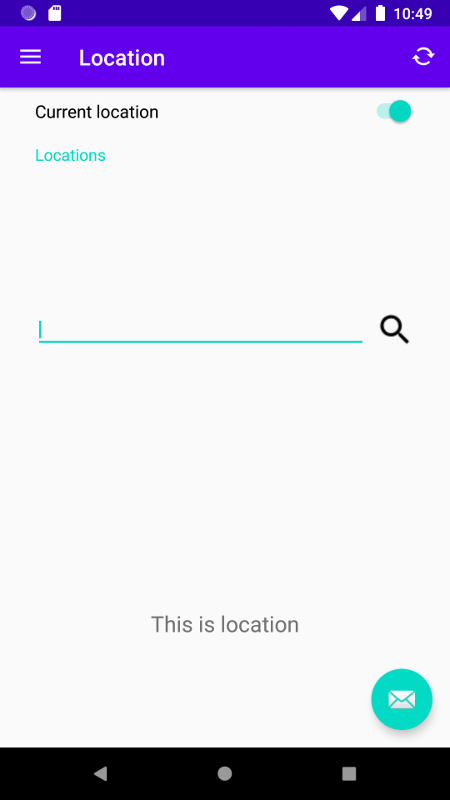

# WeatherApp

WeatherApp is an Android App.

## Software Requirement Specification

[Software Requirement Specification](https://docs.google.com/document/d/11PlzlGpMxITHS5HhDtIMljjLbUAUV1mA3qXGIWVZVJk/edit?usp=sharing)

## Project Proposal

[Project Proposal](https://docs.google.com/document/d/1AhEnc4fo6TmtCplZWVSbV3q26MH7UYLIeVJ_HXmYCTY/edit?usp=sharing)

## Public Weather API
The weather information is retrieved from [National Weather Service](https://www.weather.gov/documentation/services-web-api) , which provides weather information ONLY for United States. Here is the [Offical API guide](https://weather-gov.github.io/api/general-faqs). And this is my [guide](https://docs.google.com/document/d/190yawoRAPikutcNjbMXhjLfGBth5DBWdsS11AOkZkt0/edit?usp=sharing).

## Version
#### 2020-05-06 (version 0.0.1)
* Initiate the repository. This project has been worked as cs123 final project. 
